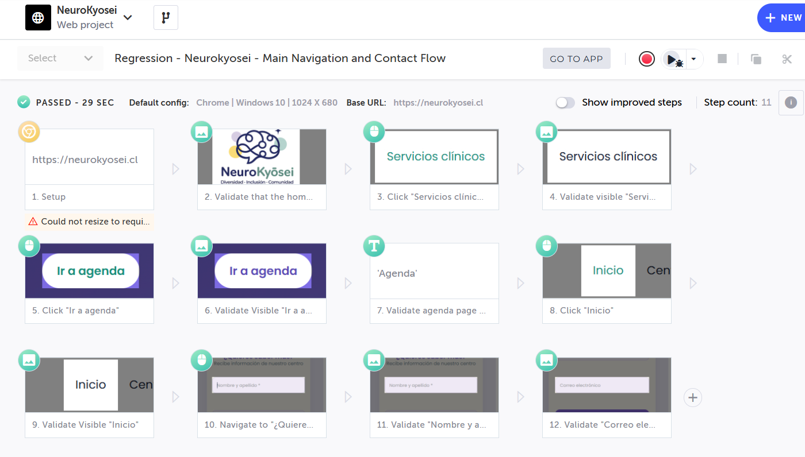
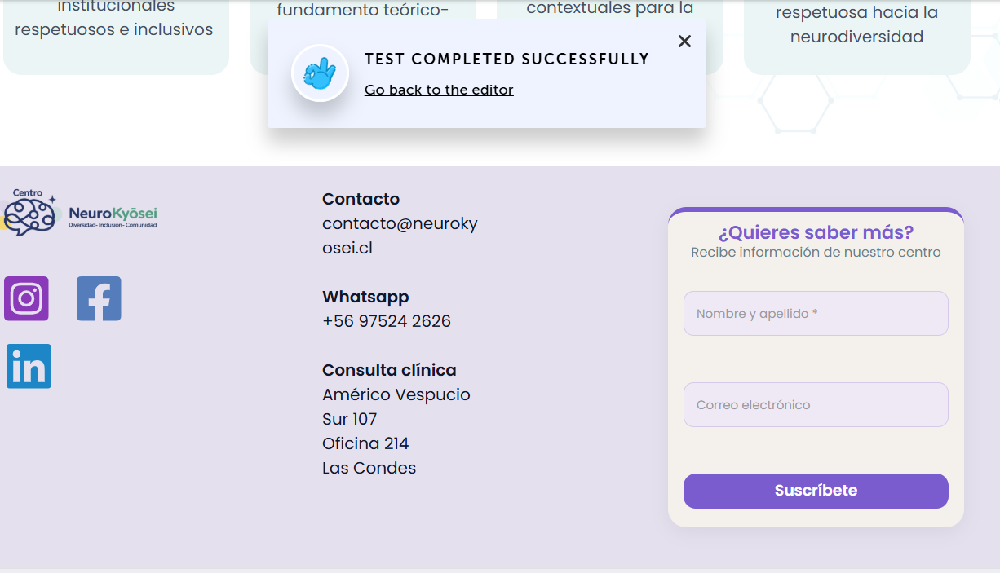

# REG-001 - Navigation and Contact Flow Regression Test

## Objective
Validate that the homepage navigation and contact flow work correctly.

## Tool
Testim

## Test Type
- Functional Testing
- Regression Testing
- UI Testing

## Validations
- Homepage visibility
- Navigation menu visibility
- "Servicios clínicos" section visibility
- "Ir a agenda" button interaction
- Contact form visibility
- "Nombre y apellido" field visibilityS
## Assertions Used
- Validate element visible
- Validate element text

## Environment
Chrome / Windows 10

## Result
PASS

## Evidence

### Regression Test Execution

### Test Flow

